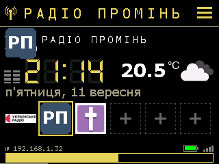
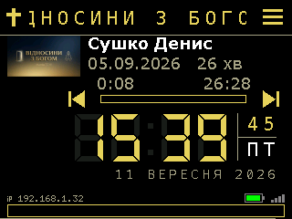
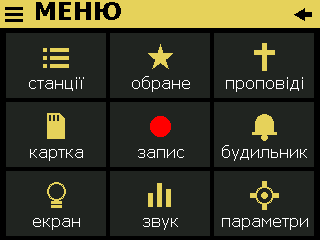
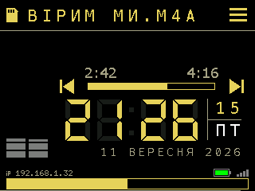
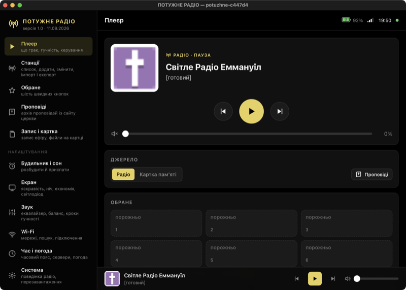

# ПОТУЖНЕ РАДІО

Інтернет-радіо на платі **ES3C28P** (ESP32-S3, сенсорний екран 2,8″, кодек ES8311, картка пам'яті, акумулятор).
Грає радіостанції з інтернету, музику й записи з картки пам'яті та проповіді з сайту церкви. Керується дотиками
до екрана, з браузера або з програм для Android, Windows і Mac, які знаходять радіо в мережі самі.

**За основу взято проєкт [yoRadio](https://github.com/e2002/yoradio) версії 0.9.693 (автор — e2002, ліцензія GPL v3):**
від нього — ядро плеєра інтернет-радіо й віджети головного екрана. Для цієї плати додано драйвери кодека ES8311,
сенсора FT6336 і картки на SDIO, а меню на екрані, веб-сторінку, програми, проповіді, будильник, запис, живлення
й обране дописано в цьому проєкті.

<p>




</p>

**Завантажити:** [останній реліз](../../releases/latest) — прошивка й готові програми.

---

## Можливості

- **Радіостанції.** Список із пошуком, логотипи станцій (радіо саме знаходить їх у каталозі radio-browser.info),
  плавна прокрутка з інерцією та «лупою» на вибраному рядку, до шести станцій в обраному — одним дотиком
  з головного екрана.
- **Проповіді** з сайту церкви: увесь архів (понад 550), обкладинки, перемотка, продовження з місця зупинки.
- **Картка пам'яті:** MP3, AAC, M4A, FLAC; список треків, перемішування, перемотка (M4A — теж).
- **Запис ефіру** на картку як є, без втрати якості.
- **Будильник** (щодня або в будні, гучність наростає) і **таймер сну** з плавним затуханням.
- **Екран:** яскравість, нічний режим за розкладом, економія батареї, заставка.
- **Живлення:** індикатор заряду, попередження про розряд, «перезавантажити» й «вимкнути» (глибокий сон,
  вмикається дотиком до екрана).
- **Звук:** еквалайзер, баланс; вбудований кодек або зовнішній ЦАП (PCM5102A, UDA1334A, MAX98357A) — зі схемами
  підключення без паяння.
- **Веб-сторінка** радіо з усім цим і більше: редактор станцій з імпортом (CSV, M3U, PLS, JSON) і експортом,
  пошук у каталозі станцій, свої логотипи, Wi-Fi, час і погода, оновлення прошивки, резервні копії.
- **Світлодіод** WS2812: стан радіо або «в такт музиці».

<p>


</p>

---

## Встановлення

### 1. Прошити плату (один раз, кабелем)

У плати немає окремої мікросхеми USB-UART, тому в режим прошивки її переводять руками:

1. від'єднайте кабель USB;
2. натисніть і тримайте кнопку **BOOT**;
3. під'єднайте кабель;
4. відпустіть BOOT.

**На Mac** — з теки `firmware` цього репозиторію (потрібен esptool з ядра ESP32 для Arduino або `pip3 install esptool`):

```bash
./flash.sh
```

**На Windows / Linux** — файл `PotuzhneRadio-ES3C28P-full.bin` із релізу:

```bash
esptool --chip esp32s3 --baud 921600 write-flash -z --flash-mode dio --flash-freq 80m --flash-size 16MB 0x0 PotuzhneRadio-ES3C28P-full.bin
```

Після прошивки від'єднайте й знову під'єднайте кабель.

> Повний образ стирає налаштування, станції й мережі. Для оновлення вже налаштованого радіо — див. нижче.

### 2. Підключити до Wi-Fi

1. Радіо саме піднімає точку доступу **PotuzhneRadio**, пароль **12345987**.
2. Підключіться до неї телефоном чи комп'ютером і відкрийте `http://192.168.4.1/`.
3. У розділі Wi-Fi виберіть свою мережу зі списку й введіть пароль.
4. Радіо перезавантажиться й підключиться. Його адресу видно внизу головного екрана (`ip 192.168.1.…`).

Мережу можна вибрати й на самому радіо: **☰ → параметри → Wi-Fi**. Радіо пам'ятає до п'яти мереж.

### 3. Керувати

- **На радіо:** дотик по назві станції — список; **☰** — меню з усім іншим; смуга внизу — гучність.
- **У браузері:** адреса з екрана радіо або `http://potuzhne-xxxx.local/` (ім'я — у «Система» на сторінці).
- **Програми** (з релізу) — знаходять радіо в мережі самі, адресу вводити не треба:

| Програма | Файл у релізі | Як поставити |
|---|---|---|
| Android 5.0 і новіші | `PotuzhneRadio-Android.apk` | Відкрийте файл на телефоні й дозвольте встановлення з цього джерела. На старих Android оновіть «Android System WebView» у Play Маркеті. |
| Windows 10/11 | `PotuzhneRadio-Windows.exe` | Просто запустіть. Якщо Windows попередить — «Докладніше» → «Все одно запустити». Потрібен WebView2 (у Windows 11 є завжди). |
| macOS 13 і новіші | `PotuzhneRadio-Mac.zip` | Розпакуйте й перетягніть у «Програми». Перший запуск — правою кнопкою → «Відкрити» (програма не з App Store). |

Усі програми показують ту саму сторінку радіо — кожне поліпшення сторінки одразу є скрізь.



---

## Оновлення

- **Через сторінку радіо:** розділ **«Оновлення»** → файл `PotuzhneRadio-ES3C28P-update.bin` → «Оновити радіо».
  Сторінка перевіряє, що це саме прошивка ПОТУЖНОГО РАДІО, і показує її версію та дату збірки.
  Станції, мережі, обране й налаштування лишаються.
- **Файли сторінки** (`app.js.gz`, `app.css.gz` з `PotuzhneRadio-web.zip`) — там само, у «Файли сторінки».
- **Програмою «Збірка ПОТУЖНОГО РАДІО»** (Mac або Windows) — кнопками «Залити прошивку» / «Залити сторінку».
- **Кабелем:** `./flash.sh --app-only` — оновлює лише програму, списки лишаються.

---

## Збирання з вихідного коду


**Програмою** (найпростіше): «Збірка ПОТУЖНОГО РАДІО» для Mac (`PotuzhneRadio-Builder-Mac.zip`) або Windows
(`PotuzhneRadio-Builder-Windows.zip` — програма разом із текою `Проєкт`). Номер версії, кнопка «Зібрати», журнал,
і одразу — заливка на радіо по Wi-Fi. Версія для Windows при першому запуску сама завантажує потрібні інструменти
(близько 1 ГБ). Версії для Mac потрібна тека з цим репозиторієм (`git clone`) — вкажіть її кнопкою «Змінити…»
вгорі програми.

**Терміналом на Mac:**

1. Встановіть [arduino-cli](https://arduino.github.io/arduino-cli/) і ядро ESP32 3.3.3:
   ```bash
   arduino-cli core update-index --additional-urls https://espressif.github.io/arduino-esp32/package_esp32_index.json
   arduino-cli core install esp32:esp32@3.3.3 --additional-urls https://espressif.github.io/arduino-esp32/package_esp32_index.json
   ```
2. Зберіть:
   ```bash
   cd firmware && ./rebuild.sh
   ```
   Перша збірка — близько 13 хвилин, наступні — кілька. Номер версії — у `firmware/VERSION`.
3. Готові файли з'являться в `firmware/`: `PotuzhneRadio-ES3C28P-update.bin` (оновлення), `-full.bin` (повний образ),
   `web/` (файли сторінки).

Програми-клієнти: `apps/*/build.sh` (Mac — лише Command Line Tools; Windows — .NET, збирається на Mac;
Android — Android SDK, без Gradle).

---

## Що де лежить

| Тека | Що там |
|---|---|
| `source/yoRadio/` | прошивка: скетч Arduino (`src/extras/` — дописане: сон, будильник, проповіді, запис, веб-API, логотипи, живлення) |
| `source/yoRadio/web/` | сторінка радіо (`app.js`, `app.css`) |
| `build/sketchbook/libraries/` | бібліотеки, з якими збирається прошивка |
| `firmware/` | скрипти збирання й прошивки, опис плати й розділів |
| `apps/` | програми: `mac-client`, `mac-builder`, `windows-client`, `windows-builder`, `android-client`, спільний код `shared` |
| `tools/` | службові скрипти для перевірок через USB |
| `media/` | знімки екрана для цього опису |

Про плату, розводку виводів і розділи пам'яті — у [firmware/README.md](firmware/README.md).

---

## Ліцензія

Прошивка заснована на [yoRadio](https://github.com/e2002/yoradio) (автор — e2002) і, як і вона,
поширюється за ліцензією **GNU GPL v3** — див. [LICENSE](LICENSE). Оригінальний опис yoRadio — у
[source/README.md](source/README.md).
